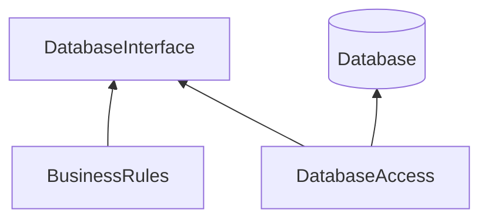

##Принцип инверсии зависимостей
Данный принцип утверждает что, наиболее гибкими получаются системы в которых зависимости в исходном коде направлены 
на абстракции, а не на конкретные реализации.
Получается что 
- Модули верхних уровней не должны зависеть от модулей нижних уровней. Оба типа модулей должны зависеть от абстракций.
- Абстракции не должны зависеть от деталей. Детали должны зависеть от абстракций.

В целом мы должны избегать зависимости от неустойчивых конкретных элементов системы. Т.е. от модулей которые продолжают
активно разрабатываться и претерпевают частые изменения. 

Распространенным примером является инверсия зависимости при взаимодействии с БД. Рассмотрим пример:

BusinessRules просто использует интерфейс для загрузки и сохранения данных. DatabaseAccess реализует данный интерфейс и
непосредственно взаимодействует с бд.

Таким образом мы не зависим от конкретной БД, тем самым бизнес-логика не зависит от модуля нижнего уровня (бд).
Рассмотрим подобный случай в коде
```java
class PasswordReminder{
    private PostgresConnection dbConnection;
    
    public void setDbConnection(PostgresConnection dbConnection){
        this.dbConnection = dbConnection;
    }
}
```
В данном случае PasswordReminder зависит от PostgresConnection, что нарушает принцип. Перепишем код
```java
interface DBConnectionInterface{
    void connect();
}

class MySQLConnection implements DBConnectionInterface {
    public void connect() {
        System.out.println("Database connection");
    }
}

class PasswordReminder {
    private DBConnectionInterface dbConnection;

    public setDbConnection(DBConnectionInterface dbConnection) {
        this.dbConnection = dbConnection;
    }
}
```
Теперь оба модуля зависят от абстракции.