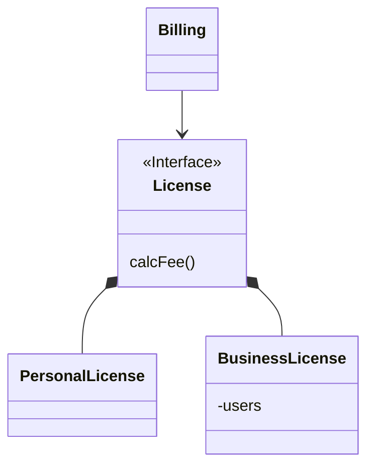
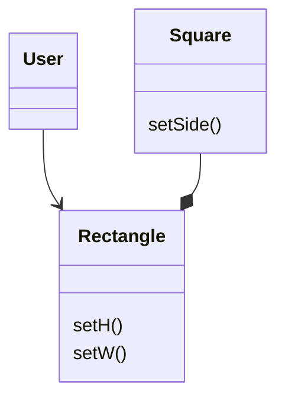

##Принцип подстановки Барбары Лисков

Цель этого принципа заключаются в том, чтобы классы-наследники могли бы использоваться вместо родительских классов, 
от которых они образованы, не нарушая работу программы. Если оказывается, что в коде проверяется тип класса, значит 
принцип подстановки нарушается.

Рассмотрим пример: 

Здесь соблюдается принцип, поскольку поведение в Billing не зависит от конкретного подтипа

Рассмотрим негативный пример

Здесь квадрат определен как подтип прямоугольника, что неверно. Т.к высота и ширина квадрата задается в отличии от прямоугольника
Следующий код наглядно показывает проблему:
```java
Class Main{
    void main(){
            Rectangle r = new Square();
            r.setW(5);
            r.setH(2);
            assert(r.area() == 10);
        }
}
```
