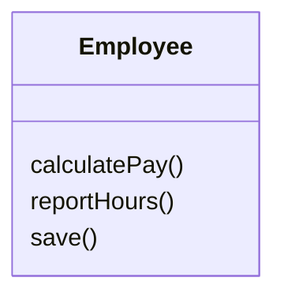
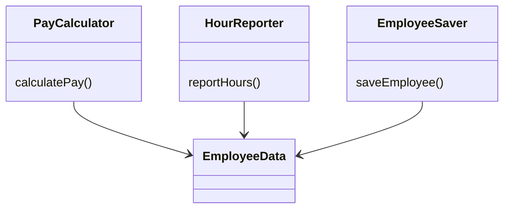
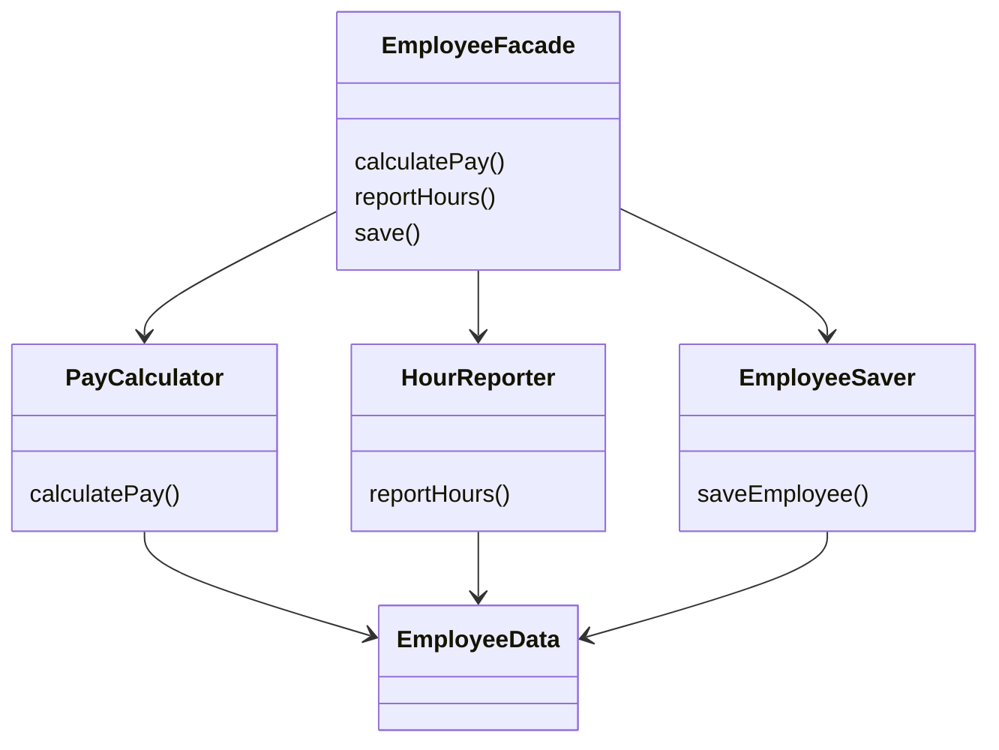

##Принцип единственной ответственности

Принцип единственной ответственности гласит, что модуль должен отвечать только за одного актора. 
Под актором понимаем группу состоящую из одного или нескольких лиц.

Рассмотрим пример:

Здесь нарушается принцип, потому что за три эти метода отвечают три разных актора. Как следствие доработка одного метода,
может повлечь неожиданные изменения в других, или также их доработку.

Для решения данной проблемы необходимо вынесение функций в разные классы, либо фактически, либо с ипользованием фасада

Пример с фасадом:

