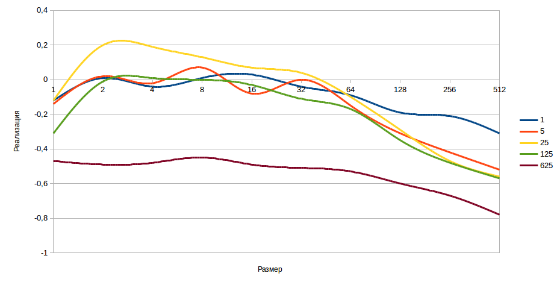

#LinkedList

LinkedList представляет собой связный список, реализует интерфейсы List, Queue, Deque

## Методы

Рассмотрим первоначально методы унаследованные от интерфейса _Collection_:

| Метод                                                 | Описание                                                                                                                                                                                                                                                                                                                                                                                                                                                                                                                                                             |
|:------------------------------------------------------|:---------------------------------------------------------------------------------------------------------------------------------------------------------------------------------------------------------------------------------------------------------------------------------------------------------------------------------------------------------------------------------------------------------------------------------------------------------------------------------------------------------------------------------------------------------------------|
| boolean add(E e)                                      | Используется для вставки элемента в коллекцию                                                                                                                                                                                                                                                                                                                                                                                                                                                                                                                        |
| boolean addAll(Collection<? extends E> c)             | Используется для вставки переданной коллекции в исходную коллекцию                                                                                                                                                                                                                                                                                                                                                                                                                                                                                                   |
| boolean remove(Object element)                        | Используется для удаления элемента из коллекции                                                                                                                                                                                                                                                                                                                                                                                                                                                                                                                      |
| boolean removeAll(Collection<?> c)                    | Используется для удаления всех элементов входящих в переданную коллекцию из исходной коллекции                                                                                                                                                                                                                                                                                                                                                                                                                                                                       |
| default boolean removeIf(Predicate<? super E> filter) | Удаляет из коллекции элементы, удовлетворяющие условию, которое задает предикат                                                                                                                                                                                                                                                                                                                                                                                                                                                                                      |
| boolean retainAll(Collection<?> c)                    | Удаляет из вызывающей коллекции все элементы кроме элементов переданной коллекции                                                                                                                                                                                                                                                                                                                                                                                                                                                                                    |
| int size()                                            | Возвращает количество элементов в коллекции                                                                                                                                                                                                                                                                                                                                                                                                                                                                                                                          |
| void clear()                                          | Удаляет все элементы                                                                                                                                                                                                                                                                                                                                                                                                                                                                                                                                                 |
| boolean contains(Object element)                      | Если передаваемый элемент есть в коллекции - true, иначе - false                                                                                                                                                                                                                                                                                                                                                                                                                                                                                                     |
| boolean containsAll(Collection<?> c)                  | Если все элементы из передаваемой коллекции есть в исходной коллекции - true, иначе false                                                                                                                                                                                                                                                                                                                                                                                                                                                                            |
| boolean isEmpty()                                     | Если вызывающая коллекция пуста - true, иначе - false                                                                                                                                                                                                                                                                                                                                                                                                                                                                                                                |
| int hashCode()                                        | Возвращает хэш-код коллекции                                                                                                                                                                                                                                                                                                                                                                                                                                                                                                                                         |
| boolean equals(Object o)                              | Проверяет равнозначны ли коллекция и переданный объект                                                                                                                                                                                                                                                                                                                                                                                                                                                                                                               |
| Iterator<E> iterator()                                | Возвращает итератор для исходной коллекции                                                                                                                                                                                                                                                                                                                                                                                                                                                                                                                           |
| default Spliterator<E> spliterator()                  | Возвращает итератор-разделитель для исходной коллекции                                                                                                                                                                                                                                                                                                                                                                                                                                                                                                               |
| Object[] toArray()                                    | Возвращает массив, содержащий все элементы вызывающей коллекции. Элементы массива являются копиями элементов коллекции                                                                                                                                                                                                                                                                                                                                                                                                                                               |
| default Stream<E> stream()                            | Возвращает поток данных, использующий коллекцию в качестве источника элементов                                                                                                                                                                                                                                                                                                                                                                                                                                                                                       |
| default Stream<E> parallelStream()                    | Возвращает поток данных, использующий коллекцию в качестве источника элементов. В этом потоке поддерживаются параллельные операции                                                                                                                                                                                                                                                                                                                                                                                                                                   |
| <T> T[] toArray(T array[])                            | Возвращает массив, содержащий элементы вызывающей коллекции. Элементы массива являются копиями элементов коллекции. Если размер переданного массива равен числу элементов в коллекции они возвращаются в заданном массиве. Если размер массива меньше чем элементов в коллекции, то создается новый массив нужного размера. Если размер переданного массива больше чем элементов, то во всех элементах, следующих за последним из коллекции, устанавливается null. Если тип коллекции и тип массива не совпадают, то генерируется исключение **ArrayStoreException** |
*Важно, что методы добавления и удаления возвращающие boolean, возвращают true если коллекция была изменена, false - если нет.

Далее рассмотрим методы интерфейса _List<E>_ :

| Метод                                            | Описание                                                                                                                                         |
|:-------------------------------------------------|:-------------------------------------------------------------------------------------------------------------------------------------------------|
| void add(int i, E object)                        | Вводит заданный объект по указанному индексу, любые введенные элементы смещаются и не перезаписываются                                           |
| boolean addAll(int i, Collection<? extends E> c) | Вводит все элементы из переданной коллекции в исходную коллекцию по указанному индексу. Возвращает true если коллекция изменилась, иначе - false |
| E get(int i)                                     | Возвращает объект, хранящийся в списке по указанному индексу                                                                                     |
| int indexOf(Object o)                            | Возвращает индекс первого экземпляра переданного элемента в списке. Если объект не найден возвращается -1                                        |
| int lastIndexOf(Object o)                        | Возвращает индекс последнего экземпляра переданного элемента в списке. Если объект не найден возвращается -1                                     |
| ListIterator<E> listIterator()                   | Возвращает итератор для обхода элементов с начала вызывающего списка                                                                             |
| ListIterator<E> listIterator(int i)              | Возвращает итератор для обхода элементов с позиции по переданному индексу                                                                        |
| E remove(int i)                                  | Удаляет элемент по заданному индексу и возвращает удаленный элемент. Список также уплотняется, элементы за удаленным смещаются                   |
| default void replaceAll(UnaryOperator<E> op)     | Обновляет каждый элемент списка значением получаемым из переданной функции                                                                       |
| E set(int i, Object o)                           | Присваивает заданный объект элементу, находящемуся в списке на позиции по заданному индексу. Возвращает прежнее значение                         |
| default void sort(Comparator<? super E> c)       | Сортирует список, используя заданный компаратор                                                                                                  |
| List<E> subList(int start, int end)              | Возвращает список, включающий элементы от позиции start до end из вызывающего списка. Ссылки на элементы в списке остаются такими же             |

Рассмотрим методы интерфейса _Queue<E>_:

| Метод                | Описание                                                                                                  |
|:---------------------|:----------------------------------------------------------------------------------------------------------|
| E element()          | Возвращает элемент из головы очереди, если очередь пуста генерируется исключение _NoSuchElementException_ |
| boolean offer(E obj) | Пытается ввести заданный объект в очередь, если был введен - true, иначе false                            |
| E peek()             | Возвращает элемент из головы очереди, если очередь пуста возвращает null                                  |
| E poll()             | Возвращает элемент из головы очереди и удаляет его, если пуста - null                                     |
| E remove()           | Удаляет элемент из головы и возвращает его, если очередь пуста - _NoSuchElementException_                 |

Рассмотрим методы интерфейса _Deque<E>_:

| Метод                                  | Описание                                                                                                                                       |
|:---------------------------------------|:-----------------------------------------------------------------------------------------------------------------------------------------------|
| void addFirst(E obj)                   | Пытается ввести заданный объект в голову очереди, если очередь фиксированной длины и нет места генерируется исключение _IllegalStateException_ |
| void addLast(E obj)                    | Пытается ввести заданный объект в хвост очереди, если очередь фиксированной длины и нет места генерируется исключение _IllegalStateException_  |
| E getFirst()                           | Возвращает первый элемент из очереди, если очередь пуста генерирует _NoSuchElementException_                                                   |
| E getLast()                            | Возвращает последний элемент из очереди, если очередь пуста генерирует _NoSuchElementException_                                                |
| boolean offerFirst(E obj)              | Пытается ввести заданный объект в голову очереди, если был введен - true, иначе false. При проблеме с фиксированной длинной - false            |
| boolean offerLast(E obj)               | Пытается ввести заданный объект в хвост очереди, если был введен - true, иначе false. При проблеме с фиксированной длинной - false             |
| E peekFirst()                          | Возвращает элемент из головы очереди, если очередь пуста возвращает null                                                                       |
| E peekLast()                           | Возвращает элемент из хвоста очереди, если очередь пуста возвращает null                                                                       |
| E pollFirst()                          | Возвращает элемент из головы очереди и удаляет его, если пуста - null                                                                          |
| E pollLast()                           | Возвращает элемент из хвоста очереди и удаляет его, если пуста - null                                                                          |
| E pop()                                | Возвращает элемент из головы очереди и удаляет его, если пуста - _NoSuchElementException_                                                      |
| void push(E obj)                       | Пытается ввести заданный объект в голову очереди, если очередь фиксированной длины и нет места генерируется исключение _IllegalStateException_ |
| E removeFirst()                        | Удаляет элемент из головы и возвращает его, если очередь пуста - _NoSuchElementException_                                                      |
| E removeLast()                         | Удаляет элемент из хвоста и возвращает его, если очередь пуста - _NoSuchElementException_                                                      |
| boolean removeFirstOccurence(Object o) | Удаляет первый экземпляр заданного объекта, true - если объект удален, false - если нет                                                        |
| boolean removeLastOccurence(Object o)  | Удаляет последний экземпляр заданного объекта, true - если объект удален, false - если нет                                                     |
| Iterator<E> descendingIterator()       | Возвращает обратный итератор, для прохода от хвоста к голове                                                                                   |

Далее рассмотрим варианты конструкторов LinkedList:

- _LinkedList()_ - пустой связный список
- _LinkedList(Collection<? extends E> c)_ - список, инициализируемый элементами из переданной коллекции

В целом LinkedList можно представлять как цепь из звеньев. Каждый элемент хранит свои данные, а также ссылки на предыдущий и следующий элемент. Таким образом мы можем перемещаться по ссылкам.
Вся работа с LinkedList сводится к изменению ссылок.

Также важно что LinkedList хранит ссылку на первый и последний элемент.

## Сложность

- Добавление в конец - O(1)
- Добавление по индексу - O(n), O(1) - если начало или конец
- get() - O(n)
- удаление по элементу или индексу - O(n)
- contains - O(n)

##Exceptions

Какая-то часть искючений перечислена в описании методов

При создании списка из коллекции: _NPE_ если коллекция null.

При любой операции по индексу _IndexOutOfBoundsException_ если индекс меньше нуля или больше размера

При генерации массива из списка: _ArrayStoreException_ если тип переданного массива и коллекции не совпадают(или не являются супертипом), _NPE_ если переданный массив null

##Сравнение arrayList и LinkedList

Исходя из теоретических познаний, самое слабое место у обоих типов списков это добавление в середину. И теоретически LinkedList имеет преимущество, т.к. в arrayList'е необходимо двигать часть элементов и иногда пересоздавать массив.
Сравним на практике работу этих коллекций: https://habr.com/ru/post/262943/
В кратце график:  , если значение по Y больше 0, то быстрее LinkedList, если меньше то ArrayList

По графику наглядно, что при большом количестве итераций быстрее ArrayList, при большом числе элементов также ArrayList быстрее.
LinkedList оказывается выигрышным при небольшом числе итераций добавления элемента и на небольшом размере коллекции.

Также использовать LinkedList имеет смысл при частых вставках в начало коллекции.