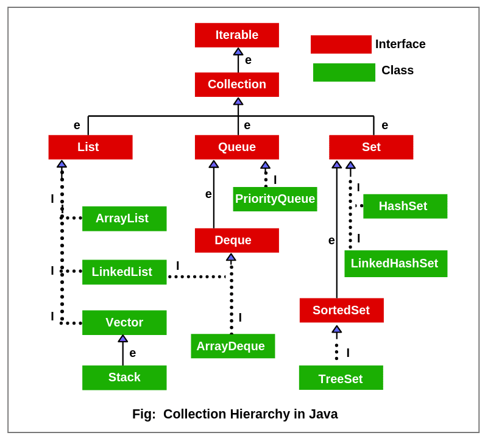

#Vector

Этот класс реализует динамический массив. Он подобен классу _ArrayList_, но имеет два отличия: синхронизирован и содержит устаревшие и дублирующие методы.
Данная класс был добавлен до внедрения коллекций в Java, после он добавился в общую иерархию отсюда и появилось дублирование.

Далее рассмотрим варианты конструкторов Vector:

- _Vector()_ - пустой вектор, с емкостью внутреннего массива 10
- _Vector(Collection<? extends E> c)_ - вектор, инициализируемый элементами из переданной коллекции
- _Vector(int size)_ - вектор, имеющий начальную емкость массива равную переданному значению
- _Vector(int size, int increment)_ - вектор, имеющий начальный размер и инкремент

При заполнении внутреннего массива вектор увеличивается на величину переданного инкремента, если он не передан, то массив удваивается.

